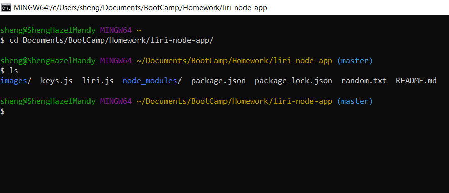
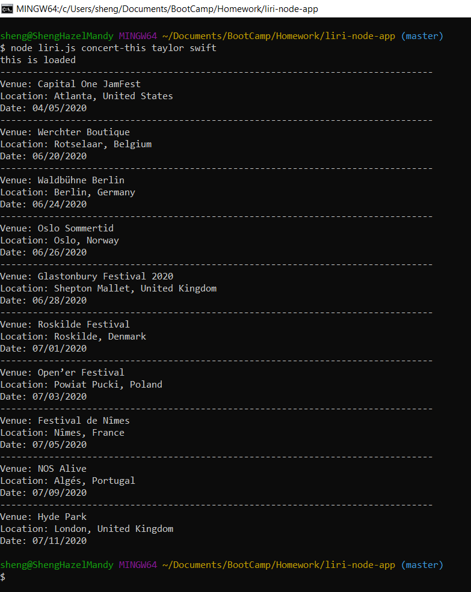
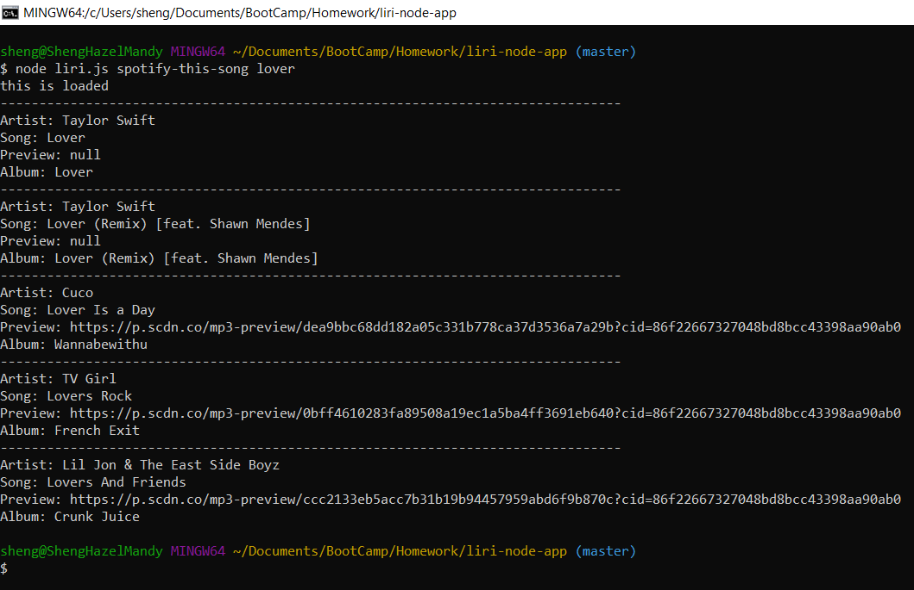
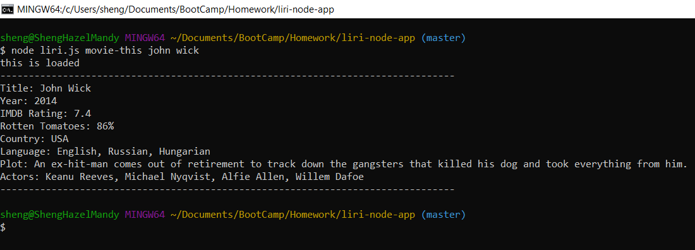
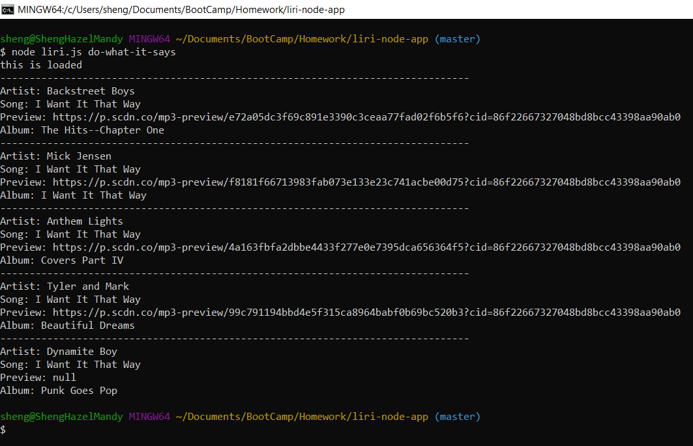

# LIRI Bot

LIRI is a Language Interpretation and Recognition Interface. `LIRI Bot` is a command line node app that takes in parameters and gives back certain data.

## Purpose

To use Node.js and JavaScript to create a command line node app that grabs data from the OMDB, Spotify, and Bands in Town API's and returns results.

## Goals

- Create a CLI node app using Javascript and Node.js
- Use for loops
- Use if/else statements
- Use functions
- Use switch statement
- Use Moment.js
- Display results from OMDB API
- Display results from Spotify API
- Display results from Bands in Town API
- Use package Node-Spotify-API
- Use package Axios
- Use package FS
- Use package Moment
- Use package DotEnv

## Technologies Used 

* Git Bash
* GitHub
* JavaScript
* Node.js
* Node packages: 
    * Node-Spotify-API
    * Moment 
    * DotEnv
    * Axios
    * FS
* API's: 
    * Bands in Town
    * OMDB
    * Spotify

## Instructions

1. Open up the terminal or Git Bash window and navigate to the folder/directory for `LIRI Bot`, or liri-node-app, where the file `liri.js` is stored. 



2. Type the command below to see the top 10 upcoming concert locations and dates for a specific artist.

```node liri.js concert-this <artist/band name here>```



3. Type the command below to see the top 5 songs on Spotify associated with your search. 

```node liri.js spotify-this-song <song name here>```



4. Type the command below to see information pulled from the OMDB API about a specific movie. 

```node liri.js movie-this <movie name here>```



5. Type the command below and the program will read the `random.txt` file and run the command and search it specifies. 

```node liri.js do-what-it-says```



## License

MIT License

Copyright (c) [2020] [Hazel N. Reyes]

Permission is hereby granted, free of charge, to any person obtaining a copy
of this software and associated documentation files (the "Software"), to deal
in the Software without restriction, including without limitation the rights
to use, copy, modify, merge, publish, distribute, sublicense, and/or sell
copies of the Software, and to permit persons to whom the Software is
furnished to do so, subject to the following conditions:

The above copyright notice and this permission notice shall be included in all
copies or substantial portions of the Software.

THE SOFTWARE IS PROVIDED "AS IS", WITHOUT WARRANTY OF ANY KIND, EXPRESS OR
IMPLIED, INCLUDING BUT NOT LIMITED TO THE WARRANTIES OF MERCHANTABILITY,
FITNESS FOR A PARTICULAR PURPOSE AND NONINFRINGEMENT. IN NO EVENT SHALL THE
AUTHORS OR COPYRIGHT HOLDERS BE LIABLE FOR ANY CLAIM, DAMAGES OR OTHER
LIABILITY, WHETHER IN AN ACTION OF CONTRACT, TORT OR OTHERWISE, ARISING FROM,
OUT OF OR IN CONNECTION WITH THE SOFTWARE OR THE USE OR OTHER DEALINGS IN THE
SOFTWARE.
